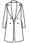
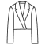
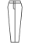
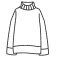

# Icons

## Icon library

The full set of functional UI icons, each in 3 states:

| State | Use |
|---|---|
| Default (dark) | Standard, on light backgrounds |
| White | On dark or colored backgrounds |
| Accent (yellow) | Active or selected state |

| Token |
|---|
| `matchy-icon-filters` |
| `matchy-icon-sort` |
| `matchy-icon-search` |
| `matchy-icon-cart` |
| `matchy-icon-menu` |
| `matchy-icon-profile` |
| `matchy-icon-notifications` |
| `matchy-icon-calendar` |
| `matchy-icon-charts` |
| `matchy-icon-share` |
| `matchy-icon-location` |
| `matchy-icon-edit` |
| `matchy-icon-delete` |
| `matchy-icon-tags` |
| `matchy-icon-visibility` |
| `matchy-icon-camera` |
| `matchy-icon-hangers` |
| `matchy-icon-archive` |
| `matchy-icon-lock` |
| `matchy-icon-delivery` |
| `matchy-icon-shield` |
| `matchy-icon-price-tag` |

## Iconography (simplified marks)

Not to be confused with the Icon library above — these represent clothing categories, not interface actions. Simplified, single-color silhouettes of garments inside a solid dark circle. Used for small formats where detail would get lost: Instagram highlight covers, compact touchpoints. Can appear inside the circular container or standalone, without it. Also doubles as category filter icons — e.g. filtering the Marketplace by garment type.

| Token | Preview |
|---|---|
| `matchy-icon-coats` |  |
| `matchy-icon-accessories` |  |
| `matchy-icon-blouses` |  |
| `matchy-icon-shirts` |  |
| `matchy-icon-tshirts` |  |
| `matchy-icon-casual` |  |
| `matchy-icon-vests` |  |
| `matchy-icon-jackets` |  |
| `matchy-icon-dresses` |  |
| `matchy-icon-jumpsuits` |  |
| `matchy-icon-skirts` |  |
| `matchy-icon-jeans` |  |
| `matchy-icon-blazers` |  |
| `matchy-icon-shorts` |  |
| `matchy-icon-shoes` |  |

## Accessibility

- Icon-only buttons need an accessible name (e.g. `aria-label`) — an icon alone doesn't convey meaning to screen reader users.
- Don't rely on the yellow "active" state color alone to show selection — pair it with a shape or fill change too, since color-blind users may not perceive the yellow/default distinction.
- Icons need a minimum 3:1 contrast ratio against their background — this is the WCAG standard for non-text elements, separate from the 4.5:1 minimum used for text.
- When an icon sits next to a text label, center-align it vertically with the text rather than aligning to the text baseline — baseline alignment makes icons look like they're floating or misaligned.
- Before adding a new icon to the set, check that its meaning translates across cultures — Matchy is built across a Sydney/LATAM context, so a symbol that reads clearly in one doesn't always read the same way in the other.
