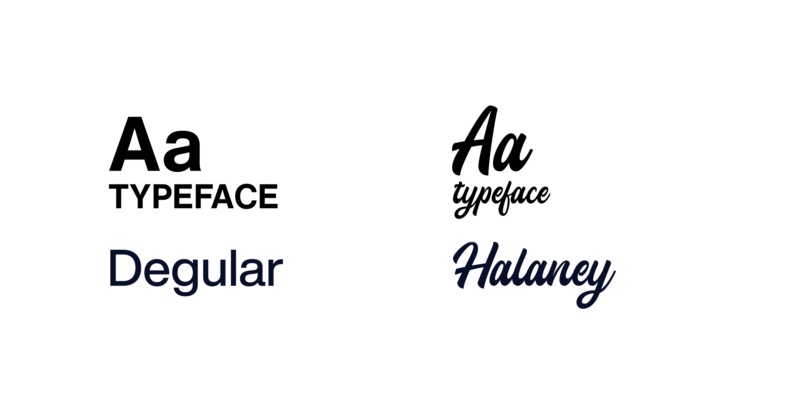

# Matchy — Typography Foundations (draft for review)

---

## 1. Rationale



> Matchy uses two typeface families with distinct, complementary roles:
>
> **Degular** is the functional voice of the system — used across the operational interface: pricing, navigation, buttons, labels, and reading text. Its clean geometry and strong legibility at small sizes support the **Intuitive Accessibility** principle: clear, scannable information with no friction.
>
> **Halaney** is the emotional voice of the brand — reserved for specific moments of discovery and connection (welcome, a match, a featured seller story).

---

## 2. Usage guidelines — Do / Don't

| ✅ Do | ❌ Don't |
|---|---|
| Use Halaney only for specific emotional moments (welcome, match, seller stories) | Use Halaney on buttons, labels, prices, or any functional text |
| Use a maximum of 2 headline levels per screen | Mix more than 2 headline sizes in a single view — it breaks the hierarchy |
| Use bold weight to emphasize text within a paragraph | Use underline for emphasis — it gets confused with a link |
| Keep Halaney phrases short (1–5 words) | Put a long sentence in Halaney — legibility drops fast in a script typeface |
| Left-align reading text | Center-align long paragraphs — harder to read, especially for users with dyslexia |

---

## 3. Accessibility

The accessibility standard (WCAG) recommends a minimum of 16px for reading text, only allowing smaller sizes for short labels or secondary text — never for paragraphs.

### Type scale

Headlines use 2 levels per family for clear, simple hierarchy. All reading text sits at or above the 16px accessibility minimum — smaller sizes are reserved for short, secondary labels.

| Style | Token | Font | Weight | Size | Letter spacing | Line height |
|---|---|---|---|---|---|---|
| Headline 1 | `matchy-heading-1` | Degular | Bold | 32px | -1% | 32 |
| Headline 2 | `matchy-heading-2` | Degular | Bold | 24px | -1% | 32 |
| Label 1 | `matchy-label-1` | Degular | Regular | 16px | 0% | 16 |
| Label 2 | `matchy-label-2` | Degular | Bold | 16px | 0% | 16 |
| Label 3 | `matchy-label-3` | Degular | Bold | 14px | 0% | 16 |
| Paragraph 1 | `matchy-paragraph` | Degular | Regular | **16px** | 0% | **24** |
| Button | `matchy-button-primary` | Degular | Bold | 16px | 0% | 16 |
| Button 2 | `matchy-button-secondary` | Degular | Bold | 12px | 0% | 16 |
| Emotional Large | `matchy-emotional-lg` | Halaney | Regular | 32px | 0% | 40 |
| Emotional Small | `matchy-emotional-sm` | Halaney | Regular | 20px | 0% | 32 |

**Paragraph 1** sits at 16px with a 24px line-height, matching the accessibility minimum for reading text.

### Exceptions that remain below 16px, and why

- **Label 3 (14px)** — used only for very short secondary metadata (a tag, a product condition, a date), never for a full sentence. At 1–3 words, the legibility risk is low, and it lets tertiary information stay visually out of the way of primary content.
- **Button 2 (12px)** — reserved for compact, secondary actions (chips, small controls) where space is limited and the label is 1–2 words. It's the floor of the scale — it shouldn't go any smaller.
- **Halaney (Emotional Large / Small)** — both sizes pass the 16px minimum, but a script typeface reduces legibility even at large sizes. Regardless of size, it should always be limited to very short phrases.

---

## 4. Free fonts while you don't have the real ones

When you want to work with Degular and Halaney but don't have them available yet (licensing, or while you decide whether the fallback stays for the portfolio), you can temporarily swap them for these free options, OFL-licensed (commercial use allowed) and installable directly from Google Fonts or `@fontsource`:

### Degular replacement → **Manrope**
- Geometric sans, rounded and warm, with a clean feel in UI at small sizes.
- Variable font, weights 300–700 → covers Regular and Bold without installing multiple files.

### Halaney replacement → **Grand Hotel**
- Connected script, elegant and retro, with a confident weight — the closest mood to what you're after for Matchy's emotional moments.

```bash
npm install @fontsource-variable/manrope
npm install @fontsource/grand-hotel
```

```ts
// main.tsx or your app's entry point
import '@fontsource-variable/manrope';
import '@fontsource/grand-hotel';
```

---

## 5. Typography tokens — grouped by font

*(For you to review and adjust before handing off to Cursor)*

### Manrope (Degular) — primitives

```css
--matchy-font-family-primary: 'Manrope Variable', sans-serif; /* future: Degular */
--matchy-font-size-100: 12px;
--matchy-font-size-200: 14px;
--matchy-font-size-300: 16px;
--matchy-font-size-600: 24px;
--matchy-font-size-700: 32px;
--matchy-font-weight-regular: 400;
--matchy-font-weight-bold: 700;
--matchy-line-height-tight: 16px;
--matchy-line-height-base: 24px;
--matchy-line-height-relaxed: 32px;
--matchy-letter-spacing-tight: -1%;
--matchy-letter-spacing-normal: 0%;
```

### Manrope (Degular) — semantic

```css
--matchy-heading-1: var(--matchy-font-family-primary) bold var(--matchy-font-size-700); /* 32px */
--matchy-heading-2: var(--matchy-font-family-primary) bold var(--matchy-font-size-600); /* 24px */
--matchy-label-1: var(--matchy-font-family-primary) regular var(--matchy-font-size-300);
--matchy-label-2: var(--matchy-font-family-primary) bold var(--matchy-font-size-300);
--matchy-label-3: var(--matchy-font-family-primary) bold var(--matchy-font-size-200); /* exception */
--matchy-paragraph: var(--matchy-font-family-primary) regular var(--matchy-font-size-300);
--matchy-button-primary: var(--matchy-font-family-primary) bold var(--matchy-font-size-300);
--matchy-button-secondary: var(--matchy-font-family-primary) bold var(--matchy-font-size-100); /* exception */
```

### Grand Hotel (Halaney) — primitives

```css
--matchy-font-family-secondary: 'Grand Hotel', cursive; /* future: Halaney */
--matchy-font-size-500: 20px;
--matchy-font-size-700: 32px;
--matchy-line-height-relaxed: 32px;
--matchy-line-height-loose: 40px;
```

### Grand Hotel (Halaney) — semantic

```css
--matchy-emotional-lg: var(--matchy-font-family-secondary) regular var(--matchy-font-size-700); /* 32px */
--matchy-emotional-sm: var(--matchy-font-family-secondary) regular var(--matchy-font-size-500); /* 20px */
```

